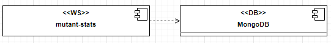

# mutant-stats

[](https://app.travis-ci.com/leosthewar/mutant-stats)
[](https://coveralls.io/github/leosthewar/mutant-stats?branch=main)

Microservicio REST GET para obtener las estadísticas de las validaciones de secuencias de ADN.

# Diagrama de componentes



  
# Descripción técnica

El servicio expone un WS tipo Rest con el método GET -> /stats/ para obtener las estadísticas de las detecciones de ADN Mutante.
El servicio realiza la consulta a la base de datos MongoDB  utilizando una agregación para agrupar y sumar la cantidad de secuencias correspondientes a mutantes y humanos.
Con el resultado de los conteos el servicio realiza el calculo del ratio, el cual se  obtiene a través de la siguiente formula 
- ratio= total_adn_mutante/ total_adn_humano 


Finalmente  el servicio responde  un json con las estadísticas.
 
# API stats
## GET/stats/
## Endpoint 
https://mutant-stats-leosthewar-dev.apps.sandbox-m2.ll9k.p1.openshiftapps.com/stats/
## Request

El request no recibe ningún parámetro

## Response
- HTTP Code 200 - Si se obtienen las estadísticas

Ejemplo respuesta 
 ```shell
{
    "ratio": 0.001,
    "count_mutant_dna": 4,
    "count_human_dna": 4889
}
```


# Instrucciones de ejecución

## Ejecución local

### Prerrequisitos

- JDK 11
- Maven 3

Para ejecutar el servicio de manera local ejecute el comando

```shell
mvn spring-boot:run
```
El servicio iniciaria en el puerto 8080.
CURL de ejemplo para consumir el servicio
 ```shell
curl --location --request GET 'http://localhost:8080/stats/'
```

## Despliegue en Openshift

### Prerrequisitos
- JDK 11
- Maven 3
- Cluster de Openshift
- Credenciales de acceso al cluster
- CLI Openshift
- Base de  datos Mongo
- Apache Kafka
- Configuración de Opensfhit para acceder a servicios externos al cluster.

Para este caso se uso un servidor sandbox proporcionado por Redhat https://developers.redhat.com/developer-sandbox

Para la base de datos se creo un closter gratuito  tipo M0 en  Mongo Cloud Services 
https://www.mongodb.com/cloud

Para configurar el acceso desde Openshift a mongo se utilizo el Add-on service  Data Access 
https://access.redhat.com/documentation/en-us/red_hat_openshift_database_access/1/html-single/quick_start_guide/index


Para desplegar el servicio en Openshift, se usa la CLI de Openshift ejecutando los siguientes comandos

- Iniciar sesión

```shell
oc login <host>
```

- Seleccionar el Project ( en este caso en el sandbox crea un project de manera automática y no se permite crear mas , por lo cual este paso se puede omitir)

```shell
oc project <project>
```

- Crear Configmap con los propiedades del servicio

```shell
oc create configmap mutant-stats-config --from-file=src/main/resources/ --dry-run=client -o yaml | oc apply --force -f -
```
- Compilar y desplegar
```shell
mvn -Popenshift clean package oc:build oc:resource oc:apply -DskipTests
```
Se crearan, entre otros, los siguientes recursos de Openshift:

- ImageStream "mutant-stats"
- BuildConfig "mutant-stats-s2i"
- DeploymentConfig "mutant-stats"
- Service "mutant-stats"
- Route  "mutant-stats"
  

Para consultar la ruta  mediante la cual se puede consumir el servicio,   ejecute el comando 
```shell
oc get route mutant-stats
```
 La ruta para el presente proyecto es 

https://mutant-stats-leosthewar-dev.apps.sandbox-m2.ll9k.p1.openshiftapps.com/stats/


CURL de ejemplo para consumir el servicio: 

 ```shell
curl --location --request GET 'https://mutant-stats-leosthewar-dev.apps.sandbox-m2.ll9k.p1.openshiftapps.com/stats/'
```

### Consideraciones

Para las ejecuciones locales y en openshift se deben tener configurado:
-  Properties de conexión y credenciales del servidor de mongodb

Para la ejecución en Openshift 
- Configuración de Openshift para  acceder a servicios externos

## Documentación general de la prueba
https://github.com/leosthewar/mutant-detector-meli-challenge